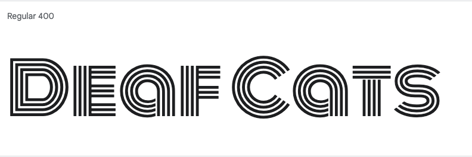
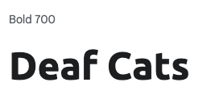
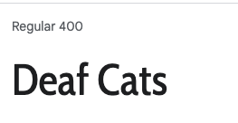

# Deaf Cats

 - image of homepage in different devices

!](documentation/)

Deaf Cats was created as my first milestone project for the Code Institutes Level 5 Diploma in Web Application Development.

Link to deployed site: [Deaf Cats]()

## CONTENTS

* [User Experience](#user-experience)
  * [Project Goals](#project-goals)
  * [User Stories](#user-stories)

* [Design](#design)
  * [Colour Scheme](#colour-scheme)
  * [Typography](#typography)
  * [Imagery](#imagery)
  * [Wireframes](#wireframes)
  * [Database Schema & User Journey](#database-schema--user-journey)
    * [User Journey](#user-journey)
    * [First Draft Database Schema](#first-draft-database-schema)
    * [Final Database Schema](#final-database-schema)

* [Features](#features)
  * [Elements Fount on Each Page](#elements-found-on-each-page)
  * [Future Implementations](#future-implementations)
  * [Accessibility](#accessibility)

* [Technologies Used](#technologies-used)
  * [Languages Used](#languages-used)
  * [Databases Used](#databases-used)
  * [Frameworks Used](#frameworks-used)
  * [Libraries & Packages Used](#libraries--packages-used)
  * [Programs Used](#programs-used)
    * [Google Books API](#google-books-api)
    * [Flask Blueprints](#flask-blueprints)
    * [Flask Migrate](#flask-migrate)
    * [Error Handling](#error-handling)
    * [Defensive Programming](#defensive-programming)
    * [Database Migration to ElephantSQL](#database-migration-to-elephantsql)

* [Deployment & Local Development](#deployment--local-development)
  * [Deployment](#deployment)
  * [Local Development](#local-development)
    * [How to Fork](#how-to-fork)
    * [How to Clone](#how-to-clone)

* [Testing](#testing)
  
* [Credits](#credits)
  * [Code Used](#code-used)
  * [Content](#content)
  * [Media](#media)
  * [Acknowledgments](#acknowledgments)

- - -

## User Experience

### Project Goals

### User Stories

#### __Target Audience__

The target audience for the website are people who like the bands music and want to 

#### __First Time Visitor Goals__

As a first time user of the site I want to be able to:

* Understand the putpose of the site and how to navigate to other pages.
* Find where I can play their music online.
* Find out more about the band and see pictures of them.
* See when and where they are playing live.
* Book the band to play at an event.

#### __Returning Visitor Goals__

As a returning registered user of the site I want to be able to:

* Find out about new music releases and where it can be played online.
* See when and where they are playing live.
* Book the band to play at an event.

#### __Admin User__

As an administrator for the site I want to be able to:

* Provide a way for the band can be contacted.
* Create a working form that sends messages to an email address.
* Create a ticket booking sytem (future releases).

- - -

## Design

### Colour Scheme

I began using the pallete below as inspiration for the colour scheme:

I then experimented with different tones and shades of these colours using WebAIM's color contrast checker:
![Contrast checker][https://webaim.org/resources/contrastchecker/]

The the contrast ratio for the chosen colors for text and header & footer background elements passes the contrast checker for all colors. 

### Typography

I used Google Fonts to import the following fonts for use in the site:

##### Logo 
 
I chose this as it has smooth curves and makes a unique logo style. 

##### Headings 
 
The font is easy to read, has good speacing between letters and continues the curves of the logo. 

##### Paragraphs 

I felt this complimented the headings font well and is a sans-serif which improves legability. 

##### Icons 

Icons are a good way to add accessability features to a website 

### Imagery

Favicon generated using [Favicon generator](https://www.favicon-generator.org/) 

As the site is for fans of the band I have chosen imsges of a group of people from a stockfile website. I have complimented these with musical themed images.Please view the media section for more information on where each image was sourced.

### Wireframes

Wireframes were created for mobile and desktop using Balsamiq.

#### __Home Page__

#### __Contact Modal__

![]](documentation/wireframes/contactus.png)

#### __Gallery Page__

#### __History Page__

#### __Live Page__

###  User Journey

#### __User Journey__

## Features

The website is comprised of 4 pages ana modal which are extended from a base template.

* Home page
* Gallery page
* History page
* Live page

* Contact form modal

### Elements found on each page

* Navbar - The Navbar is displayed on all pages of the website, it allows users to navigate the site with ease. The navbar is comprised of a logo, and links to navigate within the site and a search bar. It has a text-colour indicator to show the current page.

  __Navbar__
  
  

  __Nav-button__

    

* Footer - A footer containing the modal button and external social media icons links is displayed on all pages of the website.

__Footer__

  

- - -

### Home Page

### Gallery Page

### History Page

### Live Page

### Contact Form Modal

- - -

### Future Implementations

In future implementations I would like to:

* Create a ticket booking system/allow users to boy tickets on the website.
* Create an online shop selling merchandise.
* Add a sign up link for a mailing list.
* Add a blog documenting tour journey.
* Add a live instagram or twitter feed.
* Add an audio player with user controls to the gallery page.

### Accessibility

I have been mindful during coding to ensure that the website is as accessible friendly as possible. This has been achieved by:

* Using semantic HTML.
* Using descriptive alt attributes and titles for images and video on the site.
* Providing information for screen readers where there are icons used and no text.
* Adding "current" to navigation for screen reader to inform of page being accessed.
* Ensuring that there is a sufficient colour contrast throughout the site.

- - -

## Technologies Used

### Languages Used

HTML, CSS.

### Databases Used

[W3 Schools html]()
[W3 Schools css]()

### Frameworks Used

[Bootstrap](https://getbootstrap.com/docs/4.5/getting-started/introduction/) - V 4.5 Css framework.

### Libraries & Packages Used

[W3 Schools html]()
[W3 Schools css]()

### Programs Used

[Codeanywhere] - Online code editor.

[Balsamiq](https://balsamiq.com/) - Used to create wireframes.

[Git](https://git-scm.com/) - For version control.

[Github](https://github.com/) - To save and store the files for the website.

[Google Fonts](https://fonts.google.com/) - To import the fonts used on the website.

[Font Awesome](https://fontawesome.com/)  - For the icons on the website.

[Google Chrome Dev Tools](https://developer.chrome.com/docs/devtools/) - To troubleshoot and test features, solve issues with responsiveness and styling.

[Am I Responsive?](http://ami.responsivedesign.is/) To show the website image on a range of devices.

- - - 

## Deployment & Local Development

### Deployment

### Local Development

#### How to Fork

#### How to Clone

- - -

## Testing

Please see [TESTING.md](TESTING.md) for all testing performed
- - -

## Credits

### Code Used

All instances of Tutor support and fixes found online are documented as comments in the code.

##### Gallery Page

[Responsive Gallery Tutorial](https://blog.logrocket.com/responsive-image-gallery-css-flexbox/)
[Responsive Gallery Source Code](https://codesandbox.io/s/delicate-wave-sts6l7?file=/index.html:313-2227)
To create the gallery page I followed the above tutorial to make the responsive gallery page. Doing this helped me to learn more about how flexbox works. After this I went to make the history page.

##### History Page

[Youtube Flexbox Tutorial](https://www.youtube.com/watch?v=Y8zMYaD1bz0)
I used the tutorial playlist above to make a flexbox grid layout that becomes a stack for a smaller resolution.

##### Live Page

[Youtube timeline tutorial](https://www.youtube.com/watch?v=TcYSRI1JFQE&t=6s)
I used the timeline and knowlege gained during the Resume project to make the timeline for the tour dates. 

##### Bootstrap Components  

* Bootstrap Grid and flexbox used across all pages

* Alert
* Buttons
* Navbar
* Modal
* Form

### Content

Content for this project was written by Alice Elliott.

### Media

* Homepage Image for larger screen resolutions [street-homeimage](https://www.pexels.com/photo/two-men-and-woman-sitting-next-to-each-other-2479312/)

* Homepage Image for smaller screen resolutions/Image for gallery [street2](https://www.pexels.com/photo/man-playing-guitar-beside-woman-and-man-listening-to-him-2479320/)

* Image for gallery [street3](https://www.pexels.com/photo/man-playing-guitar-on-street-2479323/)

* Image for gallery [trumpet](https://www.pexels.com/photo/people-performing-on-stage-442540/)

* Image for gallery [guitar](https://www.pexels.com/photo/two-men-and-woman-sitting-next-to-each-other-2479312/)

* Image for gallery [outdoor-concert](https://www.pexels.com/photo/man-playing-a-saxophone-16803242/)

* Image for gallery [outdoor-concert2](https://www.pexels.com/photo/man-and-woman-dancing-while-man-in-black-clothes-playing-the-saxophone-on-the-roof-top-7502577/)

* Image for gallery [drums-studio](https://www.pexels.com/photo/man-in-black-jacket-playing-drum-5650907/)

* Image for gallery [garden-stage](https://www.pexels.com/photo/a-band-playing-music-in-a-park-in-summer-16803238/)

* Image for gallery [closeup-guitar](https://www.pexels.com/photo/close-up-of-a-man-playing-an-electric-guitar-8133318/)

* Image for history [history1](https://www.pexels.com/search/stage%20and%20tables/)

* Image for history [history2](https://www.pexels.com/photo/16844655/)

* Image for history [band-practice](https://www.pexels.com/photo/16844655/)

* Image for history [festival-stage](https://www.pexels.com/search/festival%20stage/)

* Video for history [youtube-video](https://youtu.be/wPRwhu7WKp4)
* Video for live [youtube-video](https://www.youtube.com/watch?v=St7G1F4mu_4&t=3s)

### Acknowledgments
