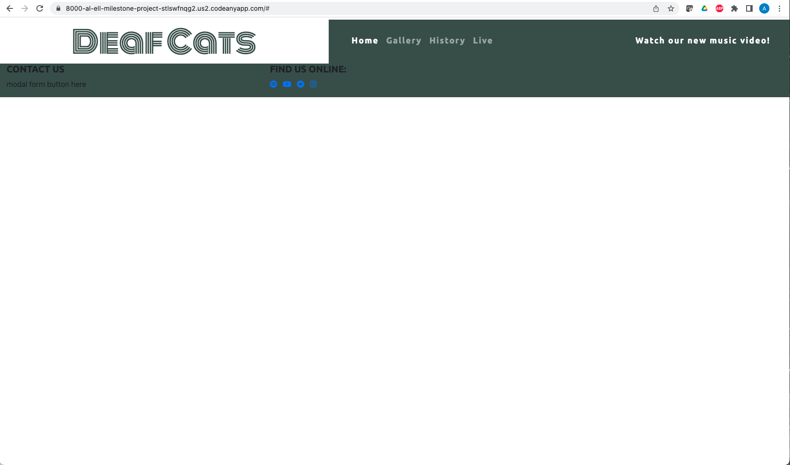
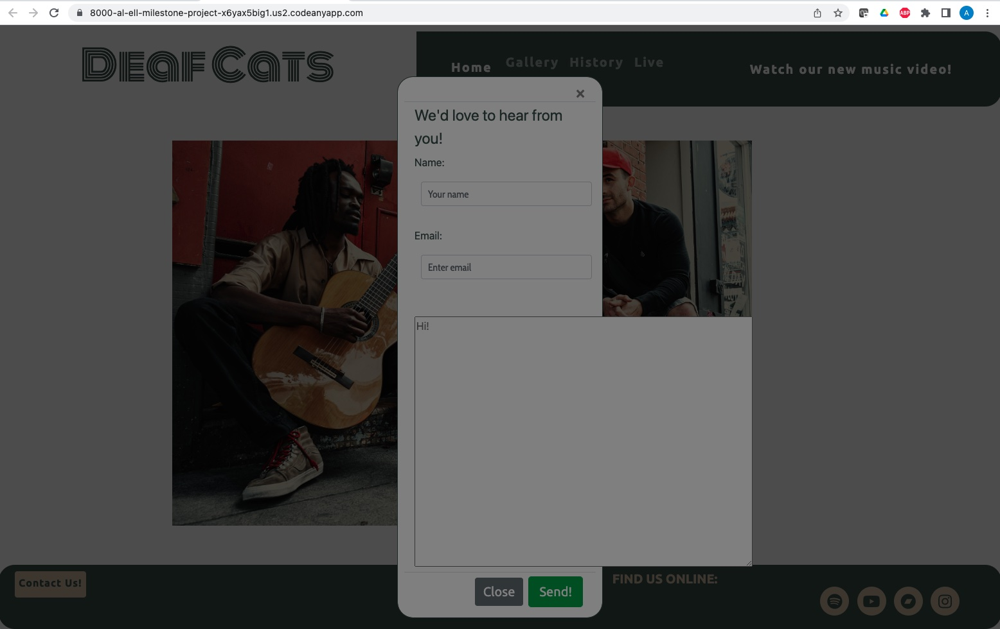
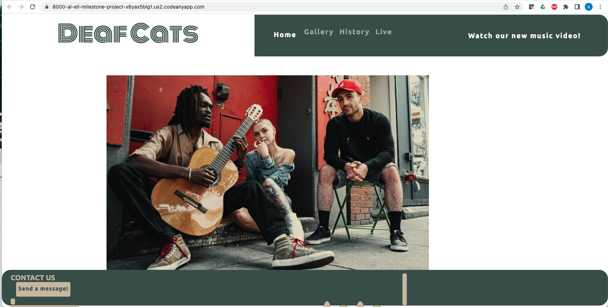
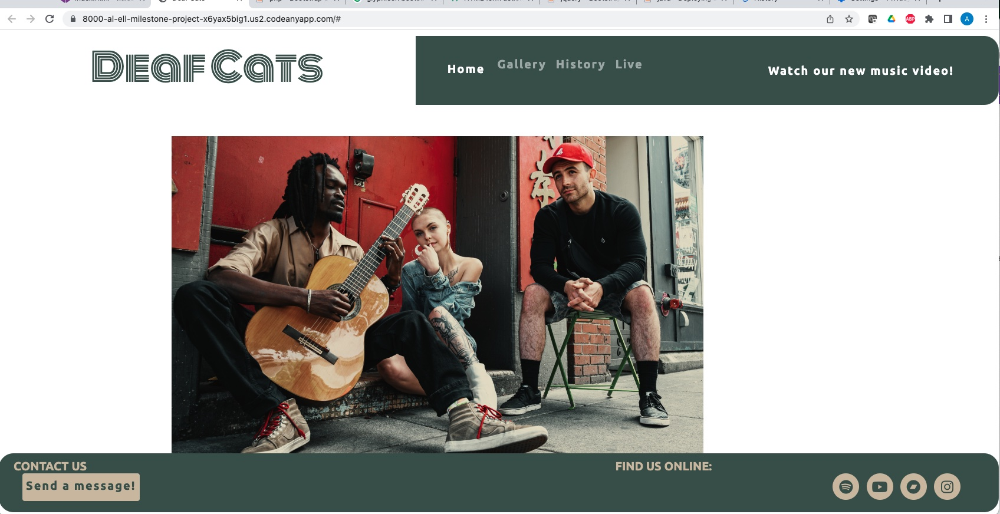
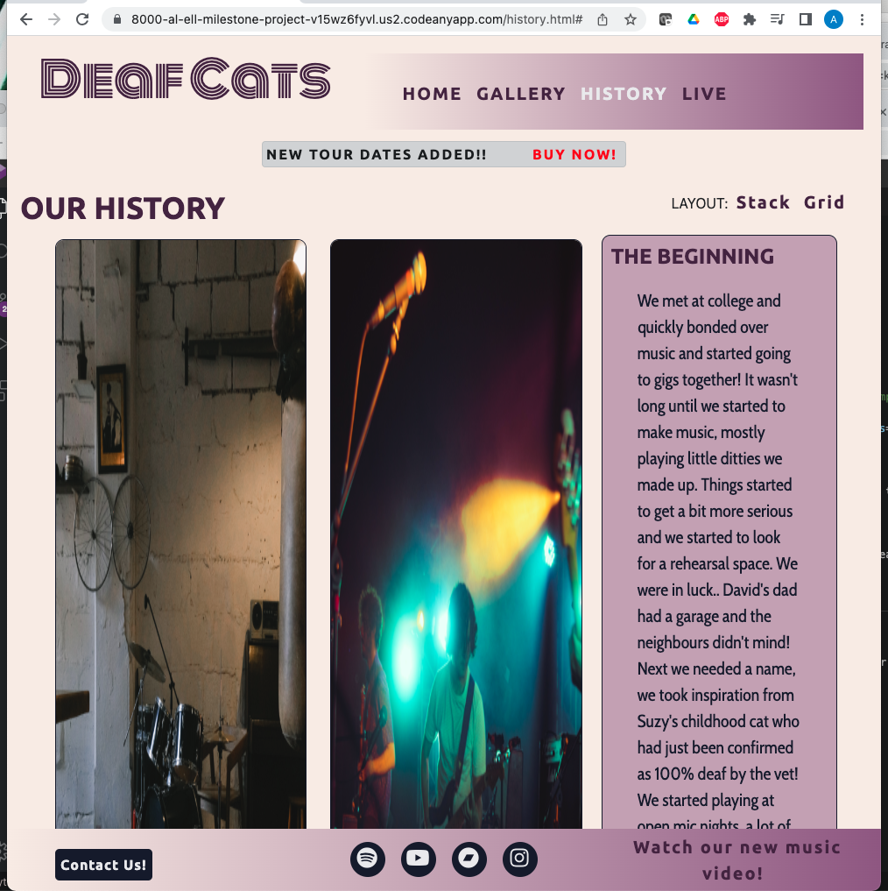
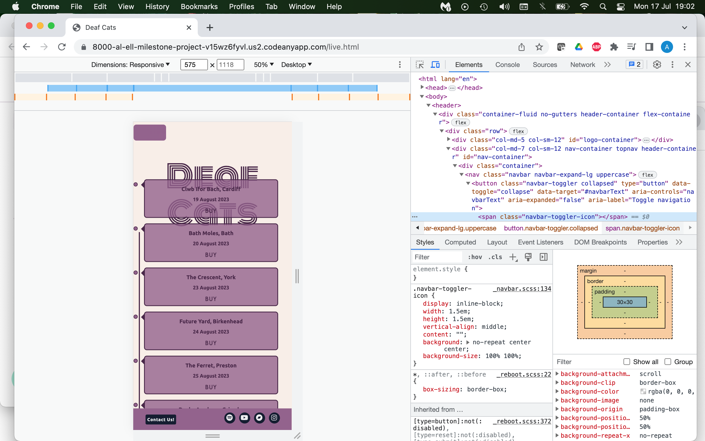
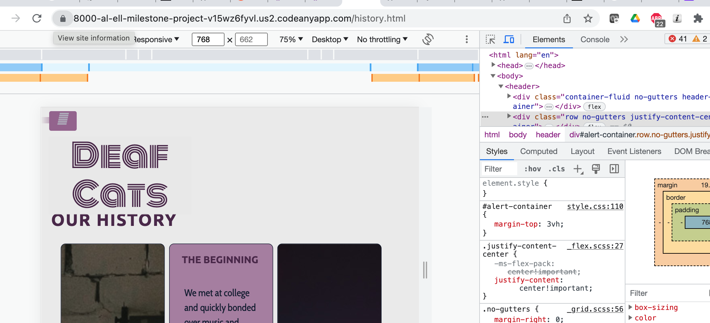
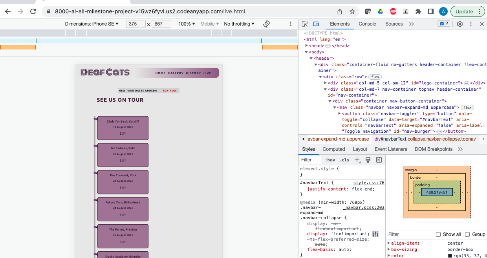
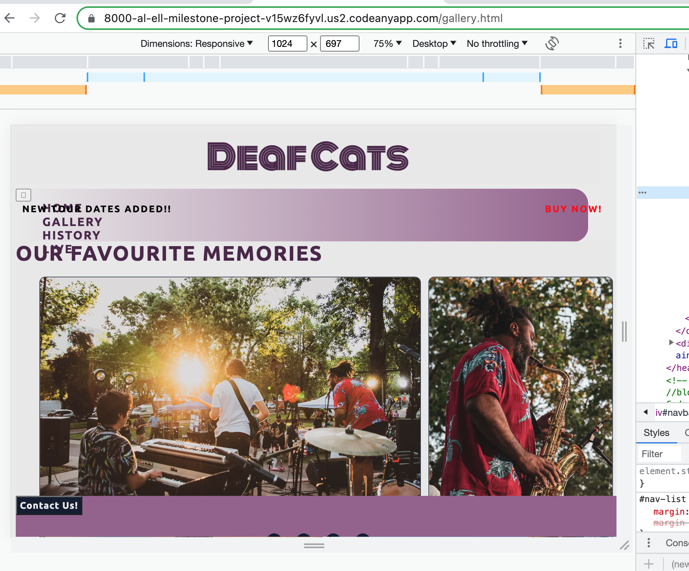
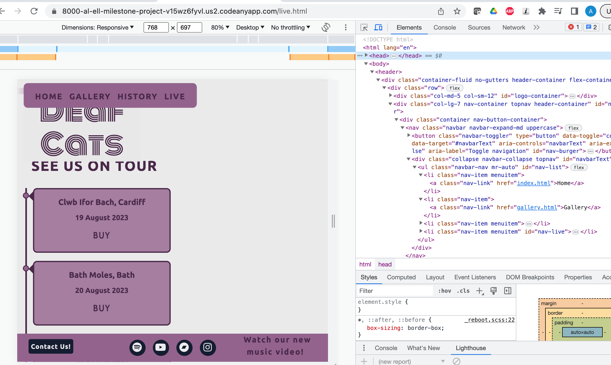

# Deaf Cats - Testing

---

## CONTENTS

- [AUTOMATED TESTING](#automated-testing)
- [W3C Validator](#w3c-validator)
- [JavaScript Validator](#javascript-validator)
- [Python Validator](#python-validator)
- [Lighthouse](#lighthouse)
- [WAVE Testing](#wave-testing)
- [MANUAL TESTING](#manual-testing)
- [Testing User Stories](#testing-user-stories)
- [Full Testing](#full-testing)
- [BUGS](#bugs)
- [Solved Bugs](#solved-bugs)
- [Known Bugs](#known-bugs)

---

## AUTOMATED TESTING

### W3C Validator

[W3C](https://validator.w3.org/) was used to validate the HTML on all pages of the website.

- [Index Page]() No errors found
- [Gallery Page]() No errors found
- [History Page]() No errors found
- [Live Page]() No erorrs found
  \_ [css]() No errors found, 3 wardnings : !["/assets/docmenation/bugs/css-jigsaw-warnings.png"]
  .

---

### Lighthouse

##### Future Updates

- Use of <iframe>
  slows down result as it is a lot of data to load. The use of <lite-youtube> (https://github.com/justinribeiro/lite-youtube/tree/main) would improve this result but I have not been able to successfully implement this.

### Desktop Results

- [Index Page]()
- [Gallery Page]()
- [History Page]()
- [Live Page]()

---

### WAVE Testing

[WAVE](http://wave.webaim.org/) (Web Accessibility Evaluation Tool)

- Missing form label for modal form text box (added)
- Contrast updated manually to pass accessability guidelines:

---

## MANUAL TESTING

### Testing User Stories

| Goals                 | How are they achieved? | Image |
| :-------------------- | :--------------------- | :---- |
| `First Time Visitors` |
|                       |                        |       |
|                       |                        | :---  |
|                       |                        | :---  |
|                       |                        | :---  |
| `Returning Visitors`  |
|                       |                        |       |
|                       |                        | :---  |
|                       |                        | :---  |
|                       |                        | :---  |
|                       | :---                   |
| `Admin User`          |
|                       |                        |       |
|                       |                        |       |

---

### Full Testing

Full testing was performed on the following devices:

- Laptop:

Each device tested the site using the following browsers:

Google Chrome

| Feature              | Expected Outcome | Testing Performed | Result | Pass/Fail |
| -------------------- | ---------------- | ----------------- | ------ | --------- | --- |
| `Navbar`             |
|                      |                  |                   |        |           |
|                      |                  |                   |        |           |
|                      |                  |                   |        |           |
|                      |                  |                   |        |           |
| `Footer`             |
|                      |                  |                   |        |           |
|                      |                  |                   |        |           |
|                      |                  |                   |        |           |
|                      |                  |                   |        |           |
|                      |                  |                   |        |           |
| `Home Page`          |
|                      |                  |                   |        |
|                      |                  |                   |        |           |
|                      |                  |                   |        |           |
|                      |                  |                   |        |           |
|                      |                  |                   |        |           |
| `Gallery Page`       |
|                      |                  |                   |        |           |
|                      |                  |                   |        |           |
|                      |                  |                   |        |           |
|                      |                  |                   |        |           |
| `History Page`       |
|                      |                  |                   |        |           |     |
|                      |                  |                   |        |           |
|                      |                  |                   |        |           |
|                      |                  |                   |        |           |
|                      |                  |                   |        |           |
| `Live Page`          |
|                      |                  |                   |        |           |
|                      |                  |                   |        |           |
|                      |                  |                   |        |           |
|                      |                  |                   |        |           |
|                      |                  |                   |        |           |
| `Contact Form Modal` |
|                      |                  |                   |        |           |
|                      |                  |                   |        |           |
|                      |                  |                   |        |           |
|                      |                  |                   |        |           |
|                      |                  |                   |        |           |

---

## BUGS

### Solved Bugs

| No. | Bug | How I solved the issue | | |
| -- | ---------------- | ---------------------- | ------ | -- | |
| 1 | Hero image won't display | I was seeking tutor support for another issue and Gemma spotted a typo, the class I was attempting to target did not match with the index page. | | |
| 2 | Modal displayed under background | Stackoverflow forum(https://stackoverflow.com/questions/41292673/bootstrap-modal-opens-but-stays-in-gray-background-and-cannot-close-or-interact) Bootstrap z-index{https://getbootstrap.com/docs/5.0/layout/z-index/} |  | |
| 3 | Social media icons altered when bootstrap updated to include script needed for Modal | Tutor assistance sought. I was not using the best Fontawesome icon classes and the script was at the top, not the bottom of the html page. |  | |
| 4 | Modal components not working when clicked | Rewatched Code Institute video on Modals and moved code to bottom of html page, now fully functioning. |  | |
| 5 | Youtube video not playing | Change of embed method, now working. | | |
| 6 | History grid made with flexbox tutorial not changing to stack style for smaller screen sizes | I requested tutor support, they suggested I use Bootstrap grid instead of flexbox to be in keeping with the rest of the website. |  | |
| 7 | Footer has too many parts for mobile view | I researched how to get different columns to dissapear, I found some help on Stack Overflow and learned about d-none for Bootstrap elements |  | |
| 8 | Navbar didn't revert to button for smaller screens | I don't know what I changed to get this working, but as I was trying to target other things it started working! However, it wasn't converting at the right breakpoint. I found some help on Stack Overflow (https://stackoverflow.com/questions/19827605/how-to-change-bootstrap-navbar-collapse-breakpoint) I then had to update margins for difference @media queries |  | |
| 9 | Homepage image didn't fit container | I researched the issue and found it was an object-fit issue. has been amended and now fills container and is responsive | | |
| 10 | Navbar container background displays under button | I changed the background colour to the same as the body for smaller screen sizes so it appears hidden. The use of display:none would resuly in no button displayed. |  | |
| 11 | @media queries not funtioning when mobile type is selected in Google dev tools, but is working in responsive setting | I had mistakenly put the meta name as the page title not as "viewport", I did this in response to validator results recently. Now I have corrected it the media queries are all functioning. |  | |
| 12 | Gallery page navigation not displaying inline as on other pages. | I found this bug during a mentoring session. I found out later that I had a typo in the <meta name="viewport"> section of the header. Once this was corrected it displayed as normal. |  | |
| 13 | Navbar not collapsed on medium screen sizes | I realised that my grid column was targeting md instead of lg for the button toggle. I changed this and now the navbar is collapsed for tablet and mobile. |  | |
| 14 | After applying flex properties to the footer sections the social links went out of alignment. | I couldn't figure out how to align them again, so after a few hours I got tutor assistance to help fix the issue. I was not targeting the right elements with flex properties. |  | |
| 15 | | | | |
| 16 | | | | |
| 17 | | | | |
| 18 | | | | |
| 19 | | | | |

---

### Known Bugs

| No  | Bug |     |
| :-- | :-- | :-- | --- | --- |
|     |     |     |     |     |
|     |     |     |     |     |
|     |     |     |     |     |
|     |     |     |     |     |
