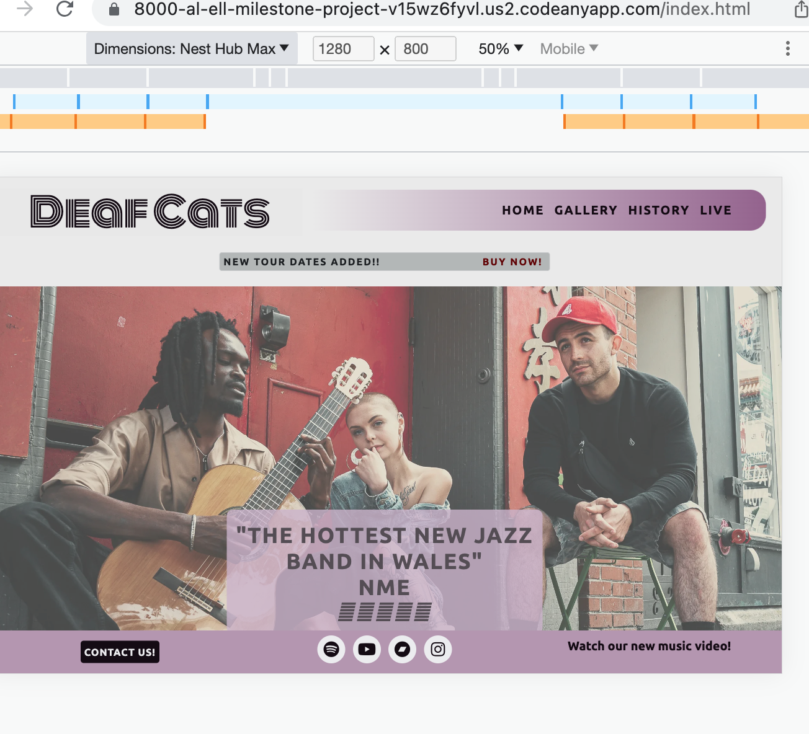
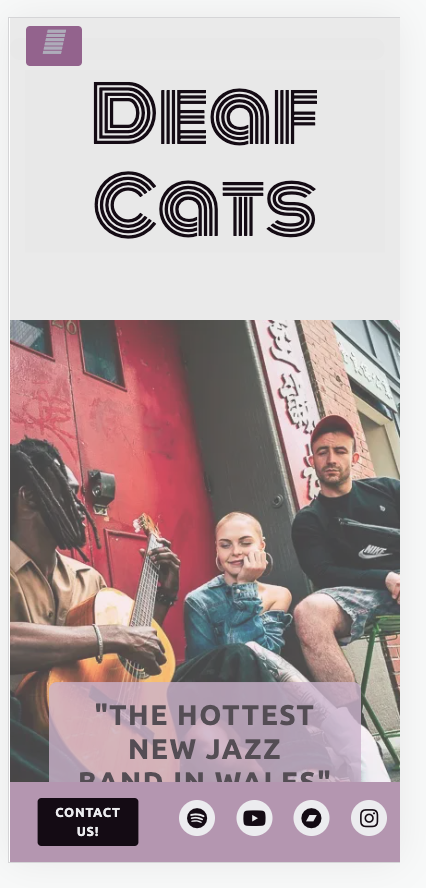
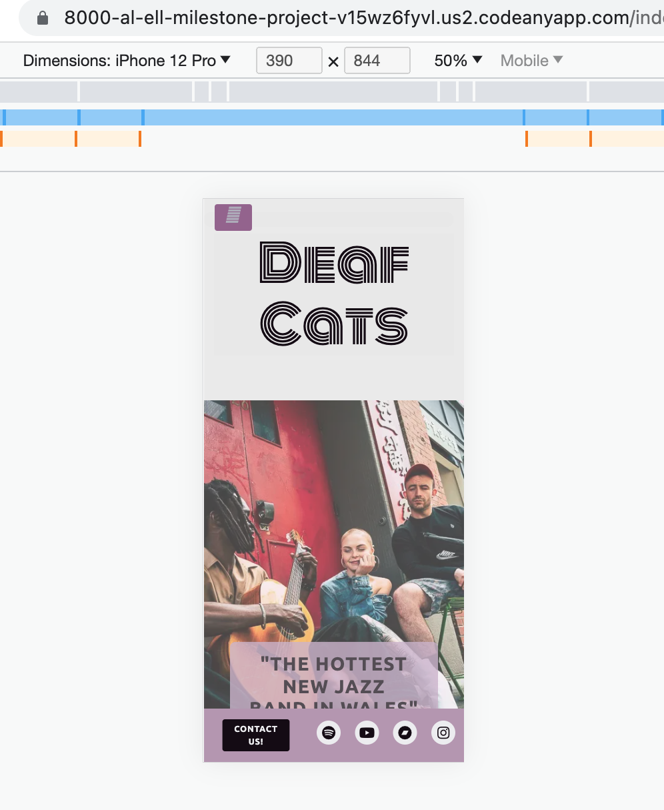
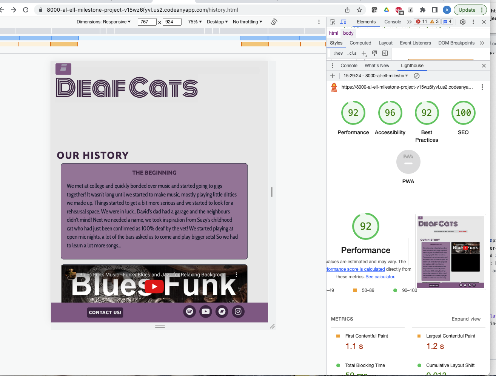

# Deaf Cats - Testing

Visit the deployed site: [Deaf Cats](https://al-ell.github.io/index.html)

---

## CONTENTS

- [AUTOMATED TESTING](#automated-testing)
- [W3C Validator](#w3c-validator)
- [Lighthouse](#lighthouse)
- [WAVE Testing](#wave-testing)
- [MANUAL TESTING](#manual-testing)
- [Testing User Stories](#testing-user-stories)
- [Full Testing](#full-testing)
- [BUGS](#bugs)
- [Solved Bugs](#solved-bugs)
- [Known Bugs](#known-bugs)

---

## AUTOMATED TESTING

### W3C Validator

[W3C](https://validator.w3.org/) was used to validate the HTML on all pages of the website.

- Index Page: No errors found
- Gallery Page: No errors found
- History Page: No errors found
- Live Page: No erorrs found

[Jigsaw W3C](https://jigsaw.w3.org/css-validator/) was used to validate the CSS stylesheet.

- css: No errors found, 3 warnings 

---

### Lighthouse

    __Index Page Desktop__
-  

    __Index Page Mobile__
-  

    __Gallery Page Desktop__
-  

    __Gallery Page Mobile__
- 

    __History Page Desktop__
-  

    __History Page Mobile__
-  

    __Live Page Desktop__
-  

    __Live Page Mobile__
-  

##### Opportunities to Improve Performance

* Eliminate render-blocking resources: remove third party CDNs, unable to improve as essential but could only import the components being used on each specific page
* Eliminate render-blocking resources: remove third party CDNs, unable to improve as essential
* Minimize main-thread work: JS  is determined by Bootstrap CDNs, I could import only the components being used instead of the whole package
* Serve static assets with an efficient cache policy: give elements a longer cache lifetime 
* Reduce JavaScript execution time: Consider reducing the time spent parsing, compiling, and executing JS. You may find delivering smaller JS payloads helps with this.
* Properly size images: I could use smaller image sizes for smaller resolutions via @media queries across all pages to reduce the loading time and use less data. 
*Some third party resources can be lazy loaded:  Use of <iframe> slows down result as it is a lot of data to load. The use of <lite-youtube> (https://github.com/justinribeiro/lite-youtube/tree/main) would improve this result but I have not been able to successfully implement this.

---

### Desktop Results

- [Index Page]()
- [Gallery Page]()
- [History Page]()
- [Live Page]()

---

### WAVE Testing

__Wave Initial Results__

[WAVE](http://wave.webaim.org/) (Web Accessibility Evaluation Tool)

- Missing form label for modal form text box (added)
- Contrast updated manually to pass accessability guidelines:

__Wave Final Results__

---

## MANUAL TESTING

### Testing User Stories

| Goals                 | How are they achieved? | Image |
| :-------------------- | :--------------------- | :---- |
| `First Time Visitors` |
| Understand the purpose of the site |  |       |
| Understand how to navigate to other pages | Clear navbar and menu buttons | :---  |
| Find where I can play their music online | Embedded Youtube videos; watch link, Spotify, Youtube and Bandcamp icons in footer  | :---  |
| Find out more about the band and see pictures of them | Gallery and History pages, Instagram icon in footer | :---  |
| See when and where they are playing live | Live dates page with listings and links to ticket selling websites | :---  |
| Contact the the band or book them to play at an event | "Contact us" button linked to form in modal | :---  |
| `Returning Visitors`  |
| Find out about new music releases and where it can be played online | Watch link, Bandcamp and Spotify icons in footer |       |
| See when and where they are playing live | Live dates page with listings and links to ticket selling websites | :---  |
| Contact the the band or book them to play at an event | "Contact us" button linked to form in modal | :---  |
|                       | :---                   |
| `Admin User`          |
| Provide a way for the band can be contacted | Modal form created, not yet linked |       |
| Create a working form that sends messages to an email address | This will be added when I learn the skills |       |
| Create a ticket booking sytem (future releases) | This will be added when I learn the skills |       |

---

### Full Testing

Full testing was performed using [amiresponsive](https://ui.dev/amiresponsive?url=https://al-ell.github.io/index.html):

Each device tested the site using the following browsers:

Google Chrome (dev tools & device types)

| Feature              | Expected Outcome | Testing Performed | Result | Pass/Fail |
| ---------------------------------------------------------------------- | -------------------------------- | ------------------------------------------------------------------------------------ | -------------------------------- | ------ |
| `Navbar` - all links tested on all pages  |
| Click on gallery page nav link |gallery page loads | clicking on link | taken to page | pass |
| Click on index page nav link |index page loads | clicking on link | taken to page | pass |
| Click on history page nav link |history page loads | clicking on link | taken to page | pass | 
| Click on live page nav link |live page loads | clicking on link | taken to page | pass | 
| Click on ticket alert link |ticket sellers website loads | clicking on link | new page opens in new tab | pass | 
| ticket alert dissapears on smaller screen resolutions | alert dissapears | use of amiresponsive & Google dev tools to test different device and screeen sizes | alert dissapears| pass | 
| `Footer`             |
| Click on spotify icon |spotify loads in new tab | clicking on link | spotify opens in new tab | pass | 
| Click on youtube icon |youtube loads in new tab | clicking on link | youtube opens in new tab | pass |
| Click on bandcamp icon |bandcamp loads in new tab | clicking on link | bandcamp opens in new tab | pass | 
| Click on instagram |instagram loads in new tab | clicking on link | instagram opens in new tab | pass | 
| Click on watch link |new page loads in new tab | clicking on link | youtube opens in new tab | pass | 
| Click on contact button |modal loads over webpage | clicking on button | modal loads over webpage | pass | 
| `Home Page`          |
| hero text sits at an appropriate height for all screen sizes | doesn't cover faces and isn't hidden by the footer | use of amiresponsive & Google dev tools to test different device and screeen sizes | alert dissapears | doesn't cover faces but is cropped by footer for almost all screen sizes | fail | 
| `Gallery Page`       |
| click on all images in the gallery | overlay text appears | clicking on images | overlay text appears | pass | 
| gallery converts from grid to stack for smaller screen sizes | gallery converts to stack | use of amiresponsive & Google dev tools to test different device and screeen sizes | gallery converts to stack| pass | 
| `History Page`       |
| history grid converts from grid to stack for smaller screen sizes | grid converts to stack | use of amiresponsive & Google dev tools to test different device and screeen sizes | grid converts to stack| pass |  
| images crop for smaller screens and grow for larger resolutions | images crop/grow | use of amiresponsive & Google dev tools to test different device and screeen sizes | images crop/grow | pass |
|youtube video plays when clicked on | video plays | clicking on iframe | video plays | pass |
| `Live Page`          |
|youtube video plays when clicked on | video plays | clicking on iframe | video plays | pass |
|youtube video dissapears on smaller screen resolutions | video dissapears | use of amiresponsive & Google dev tools to test different device and screeen sizes | video dissapears| pass | 
| buy link opens ticket seller website when clicked | seller website opens in new tab | clicking on link |seller website opens in new tab  | pass | 
| timeline items grow and shrink for different screen resolutions | use of amiresponsive & Google dev tools to test different device and screeen sizes | timeline elements change width| pass | 
| `Contact Form Modal` |
| Click on contact button |modal loads over webpage | clicking on button | modal loads over webpage | pass | 
| Click on close button |modal closes | clicking on button | modal closes | pass | 
| typing in input boxes | words appear on screen | typing in button | words appear on screen| pass | 
| typing in text box | words appear on screen | typing in button | words appear on screen| pass | 
| attempting to send empty form | | clicking on send button | nothing happens | fail | 
| `Accessability` |
| title or alt text for all non-text media | text appears/screenreader will read out | hovering over media | text appears/screenreader will read out  | pass | 

---

## BUGS

### Solved Bugs

| No. | Bug | How I solved the issue | | |
| --- | ---------------------------------------------------------------------------------------- | -------------------------------------------------------------------------------------------------------------------------------------------------------------------------------------------------------------------------------------------------------------------------------------------------------------------------------------------------------------------------------------------------------------------- | ------ | -----------------------------------------------------------------------------------------------| |
| 1 | Hero image won't display | I was seeking tutor support for another issue and Gemma spotted a typo, the class I was attempting to target did not match with the index page. |  | |
| 2 | Modal displayed under background | [Stackoverflow forum](https://stackoverflow.com/questions/41292673/bootstrap-modal-opens-but-stays-in-gray-background-and-cannot-close-or-interact) [Bootstrap z-index](https://getbootstrap.com/docs/5.0/layout/z-index/) |   | |
| 3 | Social media icons altered when bootstrap updated to include script needed for Modal | Tutor assistance sought. I was not using the best Fontawesome icon classes and the script was at the top, not the bottom of the html page. |   | |
| 4 | Modal components not working when clicked | Rewatched Code Institute video on Modals and moved code to bottom of html page, now fully functioning. |  | |
| 5 | Youtube video not playing | Change of embed method, now working. | | |
| 6 | History grid made with flexbox tutorial not changing to stack style for smaller screen sizes | I requested tutor support, they suggested I use Bootstrap grid instead of flexbox to be in keeping with the rest of the website. |  | |
| 7 | Footer has too many parts for mobile view | I researched how to get different columns to dissapear, I found some help on Stack Overflow and learned about d-none for Bootstrap elements |  | |
| 8 | Navbar didn't revert to button for smaller screens | I don't know what I changed to get this working, but as I was trying to target other things it started working! However, it wasn't converting at the right breakpoint. I found some [help on Stack Overflow](https://stackoverflow.com/questions/19827605/how-to-change-bootstrap-navbar-collapse-breakpoint) I then had to update margins for difference @media queries |  | |
| 9 | Homepage image didn't fit container | I researched the issue and found it was an object-fit issue. has been amended and now fills container and is responsive | | |
| 10 | Navbar container background displays under button | I changed the background colour to the same as the body for smaller screen sizes so it appears hidden. The use of display:none would resuly in no button displayed. | | |
| 11 | @media queries not funtioning when mobile type is selected in Google dev tools, but is working in responsive setting | I had mistakenly put the meta name as the page title not as "viewport" I did this in response to validator results recently. Now I have corrected it the media queries are all functioning. |  | |
| 12 | Gallery page navigation not displaying inline as on other pages. | I found this bug during a mentoring session. I found out later that I had a typo in the <meta name="viewport"> section of the header. Once this was corrected it displayed as normal. |  | |
| 13 | Navbar not collapsed on medium screen sizes | I realised that my grid column was targeting md instead of lg for the button toggle. I changed this and now the navbar is collapsed for tablet and mobile. |  | |
| 14 | After applying flex properties to the footer sections the social links went out of alignment. | I couldn't figure out how to align them again, so after a few hours I got tutor assistance to help fix the issue. I was not targeting the right elements with flex properties. |  | |
| 15 | Logo too large for medium screen, altert and heading out of alignment | I used chrome dev tools to find the appropriate size that won't put the sections out of alignment |  | |
| 16 |  | | | |
| 17 | | | | |
| 18 | | | | |
| 19 | | | | |

---

### Known Bugs

| No  | Bug |     |
| :-- | :----------------------------------------------- | :------------------------------------------------------------------------------------------------ | --- | 
|  1  | The hero text sits too low in the viewport | I couldn't find the right size for the text box as I have ran out of time to build (I may come back to this issue later) |  |     |
|     | The hero text sits too low in the viewport |     |  |    |
|     | The hero text sits too low in the viewport |     |  |     |
|  2  | The header top margins are too large on some devices | I have ran out of time to fix this, but adjusting the unit of measurement or being more precise may give better results. |  |     |
|  3  |  |     |     |     |
|     |     |     |     |     |
